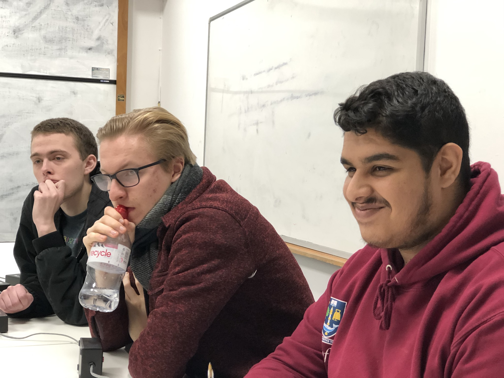
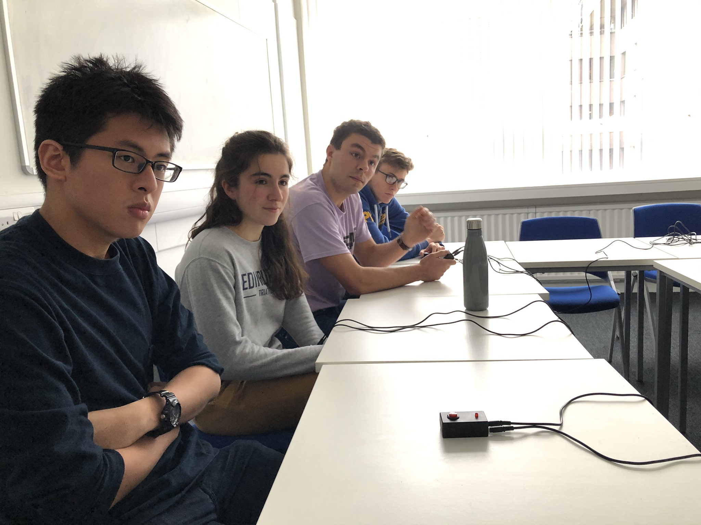

Last weekend saw the third iteration of the **British Novice Tournament**, hosted simultaneously at Imperial College, London and in Glasgow. This tournament, which was wholly British-written, is the premier event for new players and universities looking to make their first foray into quizbowl, and we were delighted to see loads of new quizzers starting off their careers.

[In London](https://hsquizbowl.org/db/tournaments/6127/), the tournament was played as an (almost) round robin. Strong teams in the morning included Bristol A, KCL and Imperial B, each of whom lost only one of their five morning matches. The well-balanced Oxford A team had a slow start, losing their first two games to KCL and Imperial B, but were steeled enough by this to win their next eight. Southampton B also went impressively undefeated in the afternoon. In a first for British quiz, a school team from Brighton College came to play, holding their own on questions intended for university students and defeating lots of very established teams on their way to an impressive 5-5 record.

At the end of the day, we ended up with an advantaged final between the top two teams, Oxford and KCL. KCL did well to establish and hold onto a good lead in a first leg which saw great buzzes on the history of Hawaii and Private Eye, overturning the advantage and forcing a two-game final, but ultimately Oxford convincingly won the second with some incredible buzzes on the history of Louisiana.

_Glasgow 1 came out on top at the Scottish site._

Due to late dropouts, the four teams [in Glasgow](https://hsquizbowl.org/db/tournaments/6135/) ended up playing a (more gruelling than expected) 12-game quadruple round robin, between two teams from Edinburgh and two from Glasgow itself. In the first round-robin, Glasgow 1 established themselves as the team to beat by clearing the field comfortably, only to lose by the tiniest of margins to their Glasgow 2 colleagues at the start of the second. This second team continued well, beating Edinburgh 1 in their next game before losing to Edinburgh 2 around lunch. As the day wore on, the standings remained close, ending with Edinburgh 2 pulling off their own field-clearing across the last three games. This late burst of inspiration sadly wasn't quite enough to win, though --- Glasgow 1 eventually prevailed with 8 wins, compared to 7 each for Edinburgh 2 and 1.

_Edinburgh 1 had a solid performance on the day with a remarkably even scoring across the four of them._

The full statistics from the day are available at the following links: [**Imperial College**](https://hsquizbowl.org/db/tournaments/6127/) and [**Glasgow**](https://hsquizbowl.org/db/tournaments/6135/). The top scorers at the London site were Jamie Burchett of Southampton B (62 points per game), Anna Brian of Bristol A (52 PPG) and Louis Triggs of KCL (51 PPG), while the leaderboard at the Glasgow site was topped by Brian Nieves of Glasgow 1 (66.67 PPG), Rishi Sundar of Edinburgh 2 (41.25 PPG) and Jedrzej Kierys of Glasgow 2 (38.33 PPG). This represents a great level of achievement for relatively inexperienced players, and we look forward to seeing all the new quizzers going on to other tournaments. Next term's calendar will include more tournaments accessible to newer teams --- follow our [Facebook page](https://www.facebook.com/quizbowluk/) to stay updated!

We're delighted to see the strong positive response to this tournament, and we hope it was an engaging and enjoyable experience for everyone who took part. If you have any thoughts on what we could do better, don't hesitate to get in contact with us.

Thanks to everyone who contributed towards writing the tournament, without whom we could never have hosted the event. Though it goes quickly during a fast-paced day of play, more than 500 questions were used, and we've been working on the set since July --- if you're interested in the process of how the tournament was written, we have an article in the works that will give you the behind-the-scenes story of the set, so keep an eye out for it!
