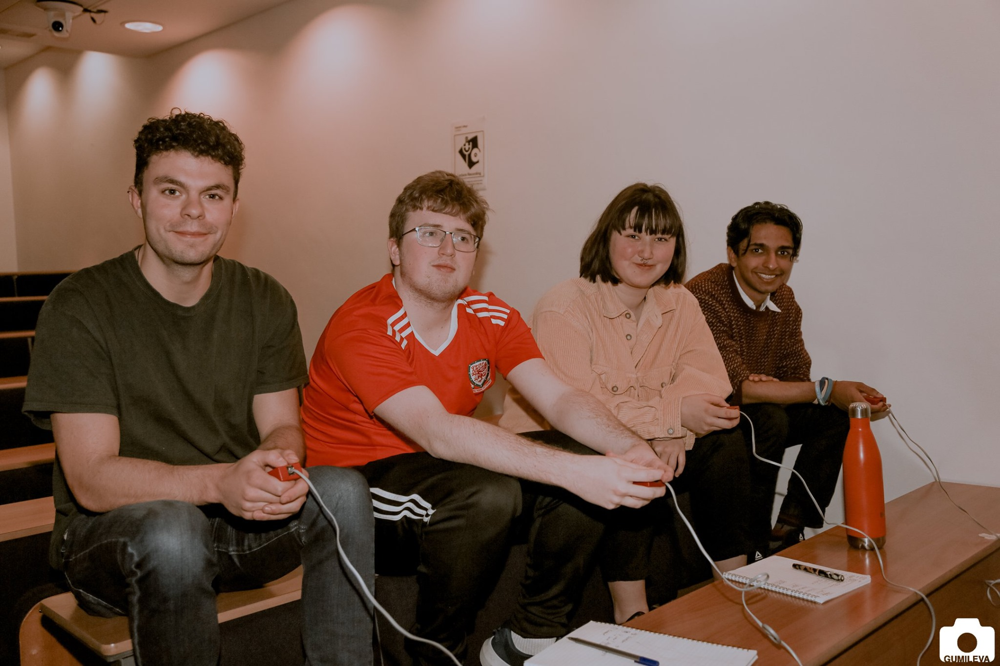
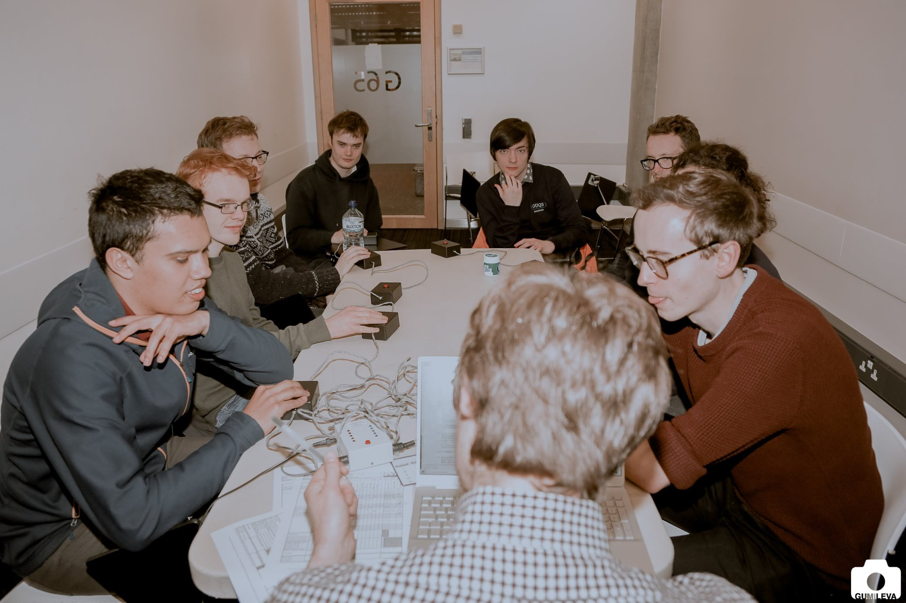
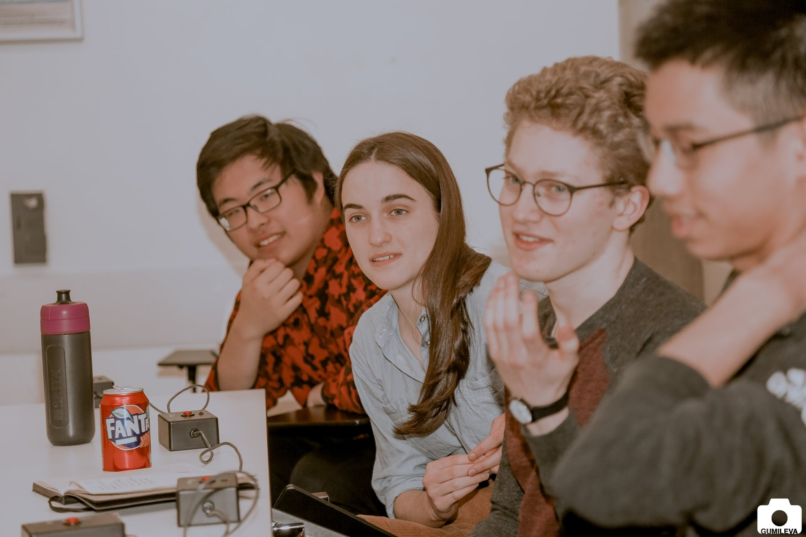
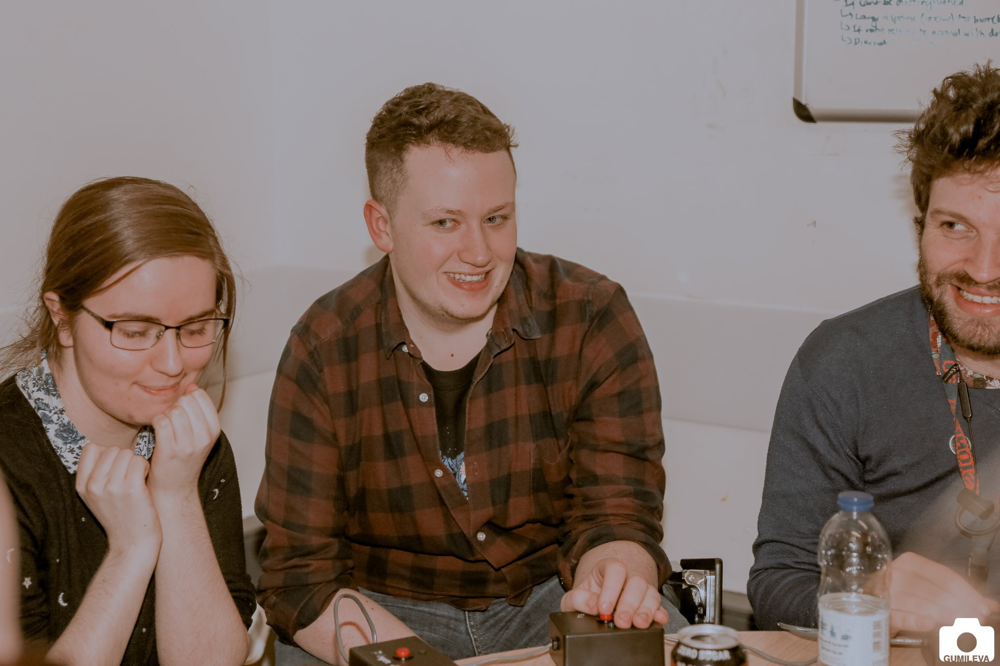
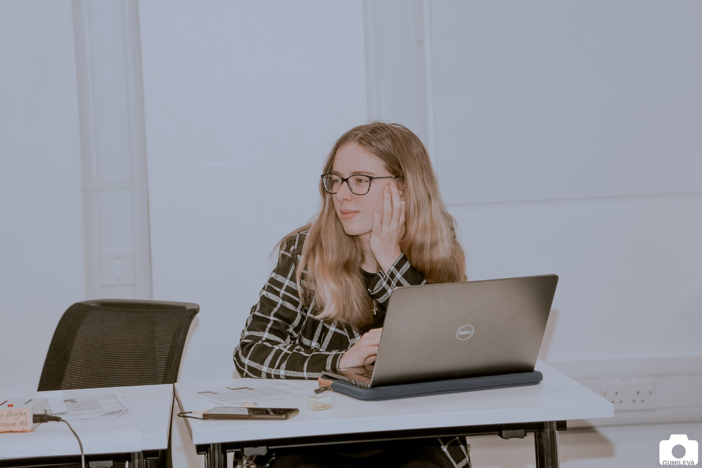

The **2020 British Student Quiz Championships** took place on Saturday, March 7th at Imperial College, London. Surpassing last year's BSQC, this year's edition yet again boasted the largest number of participants in a UK quizbowl tournament, with 28 teams representing 13 universities. In a dramatic two-game final, Cambridge A clinched the title over Southampton A to win the competition for the second time.

_Scotland was represented by four teams this year, with Edinburgh bringing two._

#### Morning rounds

The morning was run in several seeded groups. A strong showing in the Calipari group for Manchester, who were playing their first tournament of the season, saw them take second place to Evan Lynch’s Southampton A team, whose own victories included a 715 to -25 win, the highest margin in the tournament’s history. An excellent performance on tossups by Warwick A saw them take the top spot in the Pitino group, pushing the more bonus-dependent Cambridge B into second place, above Edinburgh A and two Imperial teams. A surprisingly buzzing-restrained morning from Glasgow A's Vitalijs Brejevs saw them take second place in the Boeheim group, just above some good showings by the teams from UCL, Oxford Brookes and Sheffield, while Oxford B, featuring the talented Seaon Webb in his first season, took the top spot comfortably. Although Joseph Krol’s Cambridge A team --- featuring quizbowl stalwart Sam Cook in his final student tournament after some ten years --- cleared the Donovan group, a series of closely-pitched games between Durham, Oxford C, Warwick B and Bristol kept the rest of the group finely balanced, with Durham prevailing in the end to take the second sport. Rounding out the morning was the Izzo group, won by Oxford A, captained by the UKQB President George Charlson, with second place keenly fought for between Cambridge C and Southampton B above Oxford D and Glasgow B.

_Both Warwick A (left) and Oxford B (right) finished in the top 5._

#### Afternoon rounds and finals

During lunch (and following the completion of some tiebreakers), the field was divided into two: the top 16 teams went into a double-elimination ‘card system’ format, while the two interleaved lower brackets played round robins, won respectively by Warwick B and Oxford Brookes. The afternoon was not without some unexpected games --- Cambridge A held their nerve to come back from a 130-point deficit with five questions to go against Oxford B in what will surely prove a game for the ages. This was followed by Joseph Krol delivering a stunning 13-tossup personal performance as Cambridge took revenge on Oxford A for last year’s final loss, easing past their perennial rivals. As Oxford A had delivered a solid team victory over Southampton earlier in the afternoon, this required a one-game shootout to determine which of the two Cambridge would face in the final. A tense game, which saw Southampton take an early lead which Oxford attempted to claw back, but a bravura game from Evan Lynch saw Southampton hold on to win by 35 points, 360--325.

_The hosts, Imperial, put forward three teams, with A team making the top bracket._

Thus the day culminated in an advantaged final, with Cambridge A playing Southampton A for the title, the latter needing to win the first of the two potential legs of the final to win the tournament outright. Southampton built up a commanding lead, but Cambridge made a massive comeback in the final third of the game to bring it back. 40 points down going into the final tossup, a neg by Southampton meant Cambridge needed to answer all three bonuses of the final set to win. Three bonuses on Russian literature were, one-by-one, dispatched, a chorus of gasps arising as Cambridge seemed to have eked out the narrowest possible win. But an earlier protest by Southampton was resolved in their favour, awarding them the victory, and so forcing a second final. This game played out almost as a mirror image of the first --- Cambridge fast out of the blocks, building a towering lead, only for Southampton to make one of the greatest comebacks in British quiz history, taking seven of the last eight questions with incredible bonus conversion. Cambridge just held them off, and after a tense wait another Southampton protest was not upheld. Thus Cambridge won 425--385 in an immensely high quality final game, which saw the highest aggregate score in BSQC history, a sign of the ever-increasing skill of the best teams in this country.

_Sheffield made their long-awaited return to BSQC this year._

#### Statistics, media and acknowledgements

The [**full set of statistics**](https://hsquizbowl.org/db/tournaments/6425/) from the day is available (see links on the right-hand side of the page). The [**full photoset**](https://www.facebook.com/pg/quizbowluk/photos/?tab=album&album_id=3525778594163744) can also be found on our Facebook page.

UK Quizbowl would like to thank all competitors for taking part in what we hope was an enjoyable, if lengthy, day. If you enjoyed the experience and would like to learn more about the British quizbowl scene, this website contains several guides for how to get more involved: please get in touch with UKQB if you would like any advice or help for you and your university’s team.

_It is thanks to continued volunteer efforts of moderators that we are able to run student quizbowl events in the UK._

Additionally, we would like to thank the tireless editing team who Briticised the set so brilliantly: Alex Bubb, Charlie Clegg, Daoud Jackson, David Stainer, Elysia Warner, Ewan MacAulay, Frances Clark-Murray, Ian Bayley, Joey Goldman, Jonathan Elliott, Kyle Haddad-Fonda, Luke Pitcher, Michael Levy, Peter Sloman, Sam Swift, Samantha Warnakulasuriya, Tom Hill, and Tom Speller, all headed by the quizbowl legend Edmund Dickinson in his ninth and final year of directing the process. Thanks also to everyone who came down to help on the day: in addition to the above, they are Ronny Jackson, Afham Raoof, Thomas De Bock, Emily Wolfenden, Ben Salter, Susan Rutter, Tom Hill, Chris Stern, Emma Laslett, Simon Alvey, Nina Grant, Stanley Wang, Dennis Dennis, Chris Savory and Michael Liu. Finally, we must express gratitude to the entire Imperial Quiz Society, who worked very hard on organising the venue and sorting out an uncountable number of logistical questions. We really could not have run it without you, and look forward to seeing you at future tournaments, including BSQC 2021!
